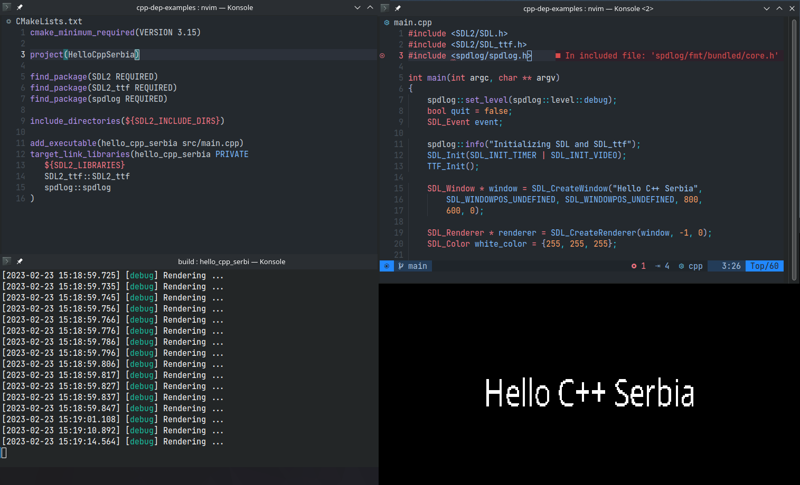

[](https://github.com/nkoturovic/cpp-nix-project-template)
[](https://isocpp.org/)
[](https://builtwithnix.org/)
[](https://kotur.me)

# CPP Serbia Nix examples 

This repository contains code samples used in the C++ Serbia meetup on Nix package manager.

[](https://www.youtube.com/watch?v=Y2Aq8pMsLz4)

## Other links

- [cpp-nix-project-template](https://github.com/nkoturovic/cpp-nix-project-template/) - Project template for C++ project, and Nix as a package manager
- [kotur-nixpkgs](https://github.com/nkoturovic/kotur-nixpkgs) - Custom nixpkgs channel
- [cpp-rest-server](https://github.com/nkoturovic/cpp-rest-server) - Demo project, uses [cpp-nix-project-template](https://github.com/nkoturovic/cpp-nix-project-template/).

## Dependencies

- C++ compiler, [CMake](https://cmake.org/)
- [Conan package manager](https://conan.io/) ([`03_conan`](./03_conan))
- [Nix package manager](https://nixos.org/download.html) ([`04_nix-shell`](./04_nix_shell), [`05_nix`](./05_nix))
- [Docker](https://docker.com) ([`02_docker`](./02_docker))
- Libraries: SDL2, SDL2_ttf, fmt, spdlog

## Building and running demo app

### Building demo app

There are multiple directories, all containing same app but different way of getting dependencies



[`01_system`](./01_system): Relies on a system package manager

```sh
mkdir build && cd build
cmake ..  -DCMAKE_BUILD_TYPE=Debug
make
```

[`02_docker`](./02_docker): Relies on Docker

```sh
docker build -t hello_cpp_serbia .
docker run hello_cpp_serbia
# You will probably need to stop it
docker stop $(docker ps -a -q  --filter ancestor=hello_cpp_serbia)
```

[`03_conan`](./03_conan): Relies on the Conan package manager

```sh
mkdir build 
cd build
cmake .. -DCMAKE_BUILD_TYPE=Debug
make
```

[`04_nix-shell`](./04_nix_shell): Relies on the Nix package manager

```sh
nix-shell
mkdir build 
cd build
cmake .. -DCMAKE_BUILD_TYPE=Debug
make
```

[`05_nix`](./05_nix): Relies on the Nix package manager

```sh
nix-build
./result/bin/hello_cpp_serbia ../OpenSans-Regular.ttf
```
### Running demo app

App requires one argument (ttf font) which will be used when rendering the message.

Specify relative path to [./OpenSans-Regular.ttf](./OpenSans-Regular.ttf) as a first argument, depending on where are you calling app from.

```sh
./result/bin/hello_cpp_serbia <REPO_ROOT>/OpenSans-Regular.ttf
```

For more instructions look at the [cpp-nix-project-template](https://github.com/nkoturovic/cpp-nix-project-template/)
